# Train a YOLOv8 seg model via Google Colab.
### create a colab project in Google drive.
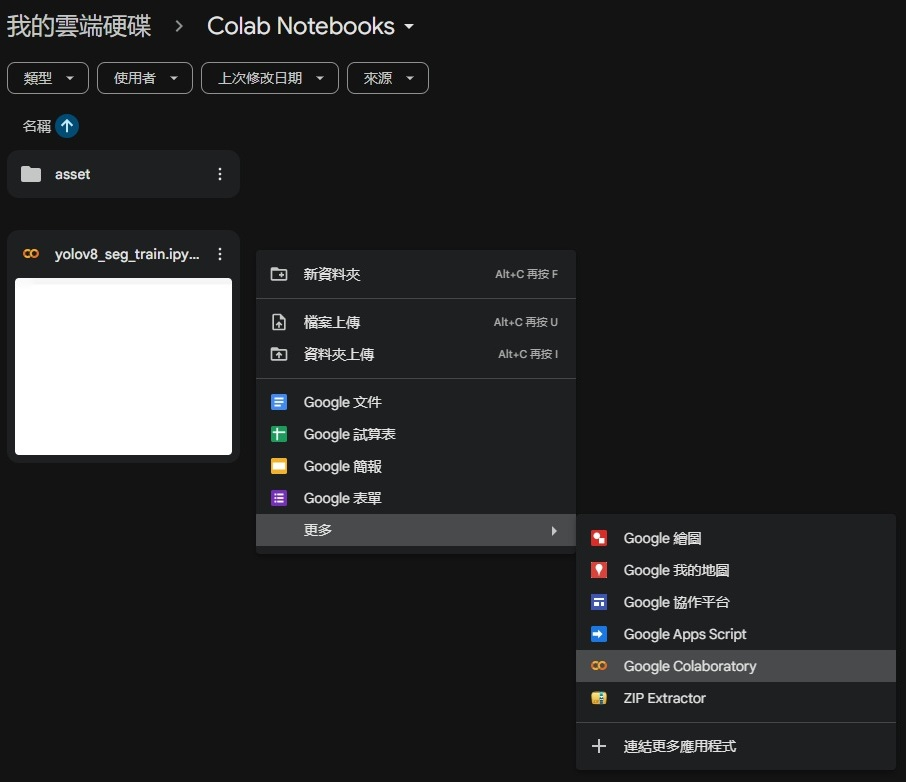

# GPU settings
### toolbar > Edit > Notebook settings.
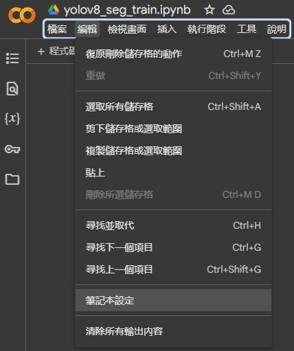

### GPU select
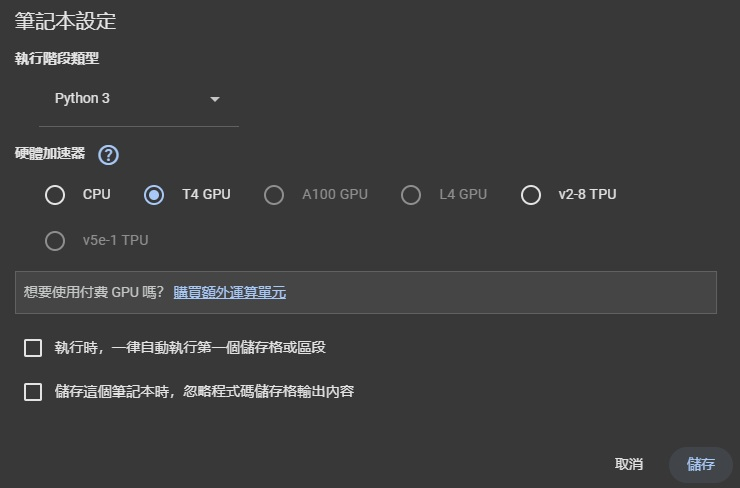

# Before you start coding the notebook, using command nvidia-smi to check GPU state
### Adding code in notebook.
```
!nvidia-smi
```
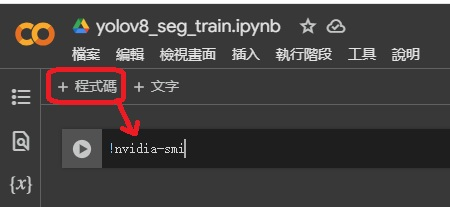

### Execute and show up process.
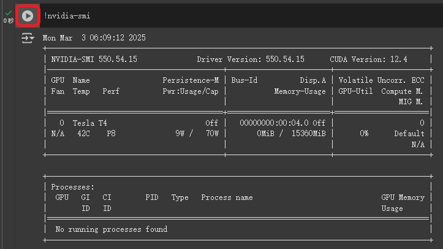

# Start coding your notebook
### check current path
```
import os
HOME = os.getcwd()
print(HOME)
```
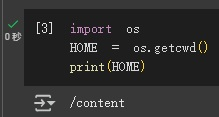

# Install YOLO
### Pip install method (recommended)
```
!pip install ultralytics

from IPython import display
display.clear_output()

import ultralytics
ultralytics.checks()
```
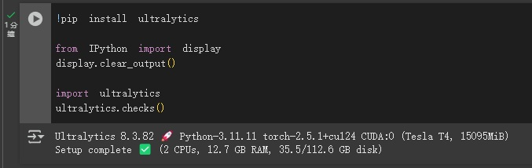

# Preparing your custom dataset
### you can create your custom dataset via Roboflow(web) or label studio(labeling tool) <br/> Here I've using the Roboflow for further demo.

- Register a Roboflow account
- Using open source "https://universe.roboflow.com/diplom-qz7q6/defects-2q87r/dataset/16"

### Download the dataset via Roboflow.
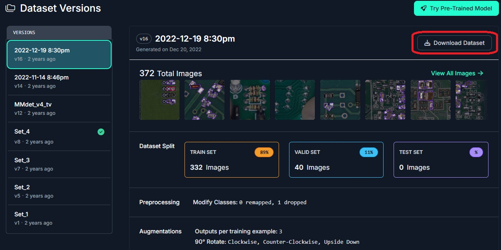

### Select download the dataset button.
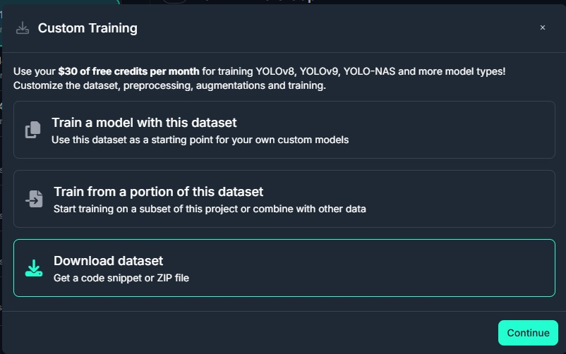

### Here choose the YOLOv8 for further demo.
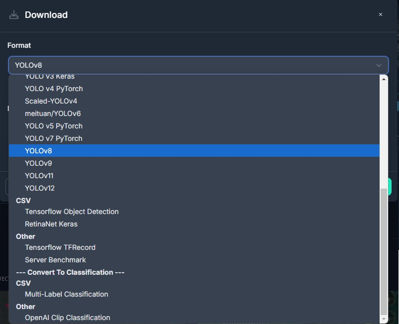

### Select "show download code" option then hit continue button.
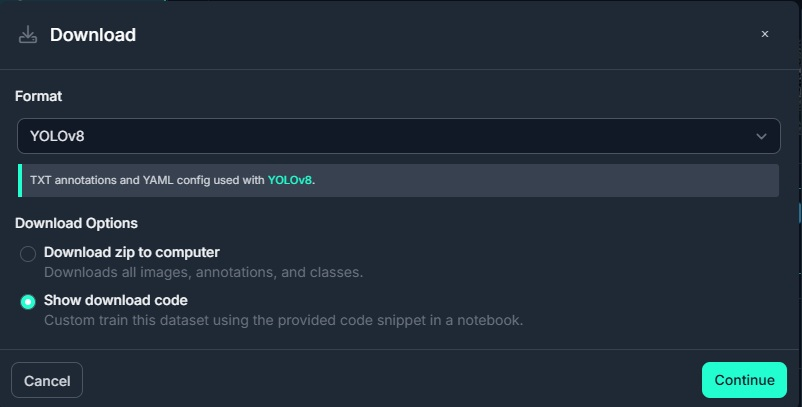

### Paste code in notebook.
```
!pip install roboflow

from roboflow import Roboflow
rf = Roboflow(api_key="----your API key----")
project = rf.workspace("diplom-qz7q6").project("defects-2q87r")
version = project.version(16)
datase
```
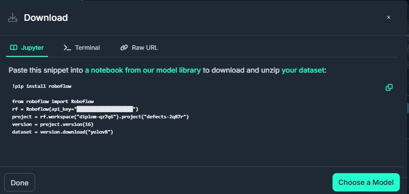

### Download successful
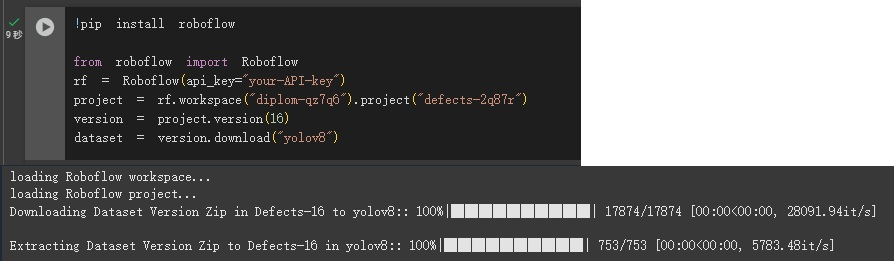

# Start train via notebook
```
!mkdir datasets
!cp -rf Defects-16/* datasets/
!yolo segment train data=datasets/data.yaml model=yolov8m-seg.pt epochs=100 imgsz=[640,480] batch=-1
```
### Figure 1:
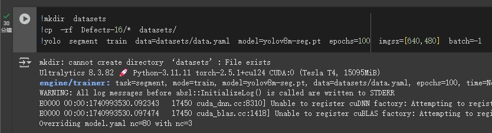

### Figure 2:
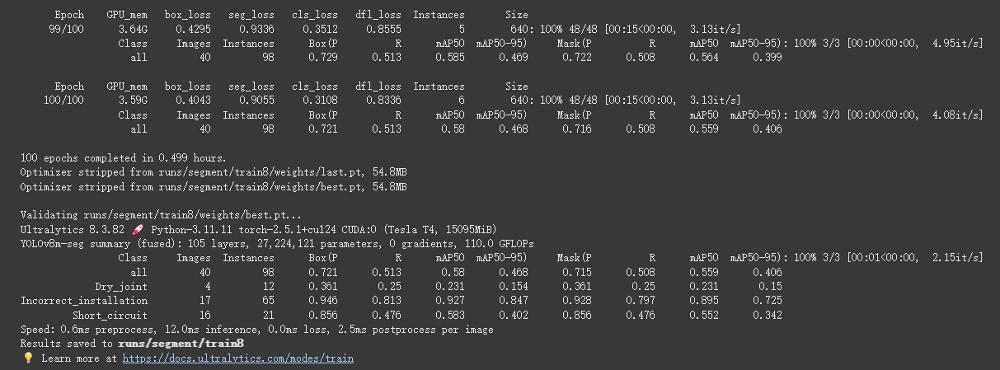

# Download your custom trained model
```
from google.colab import files
files.download('runs/segment/train8/weights/best.pt')
```
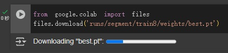