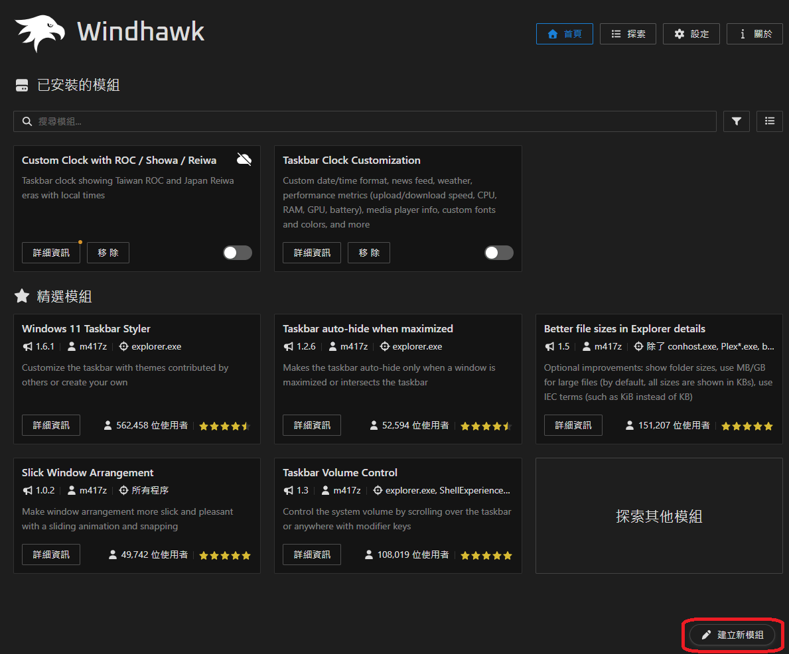
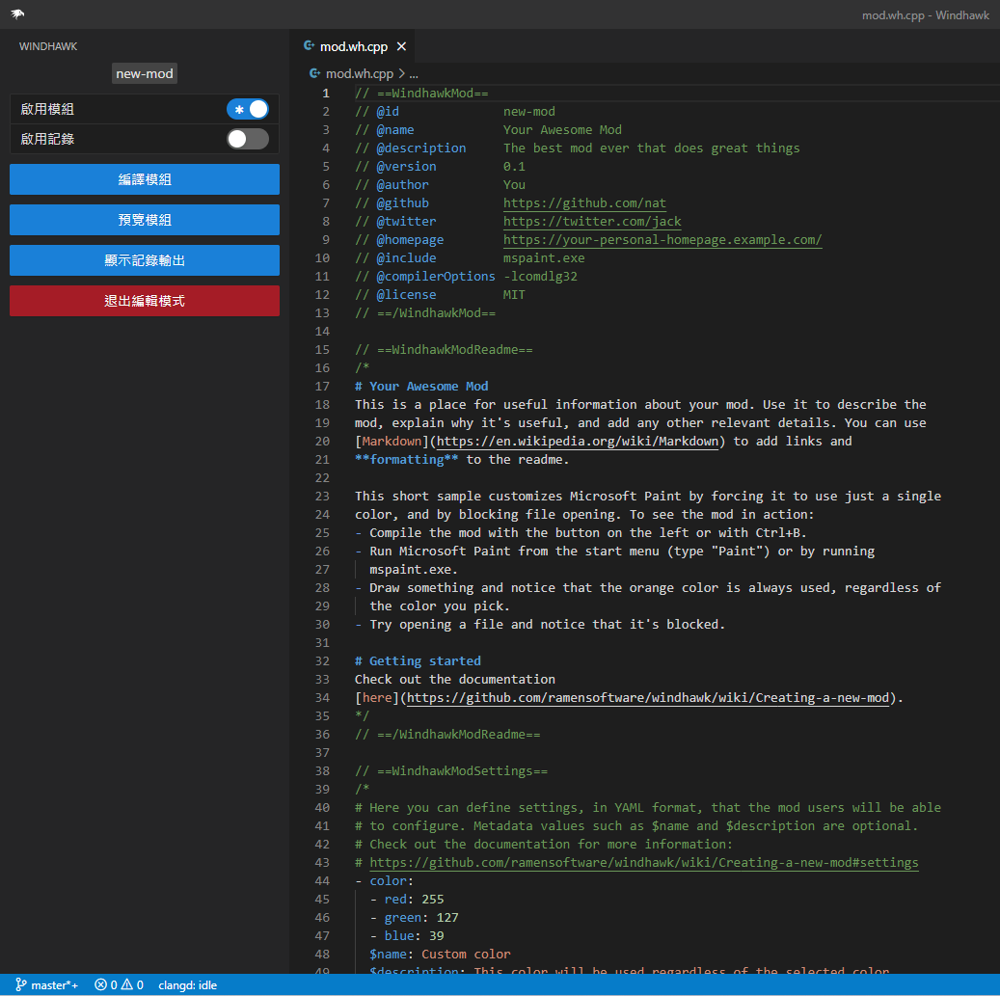
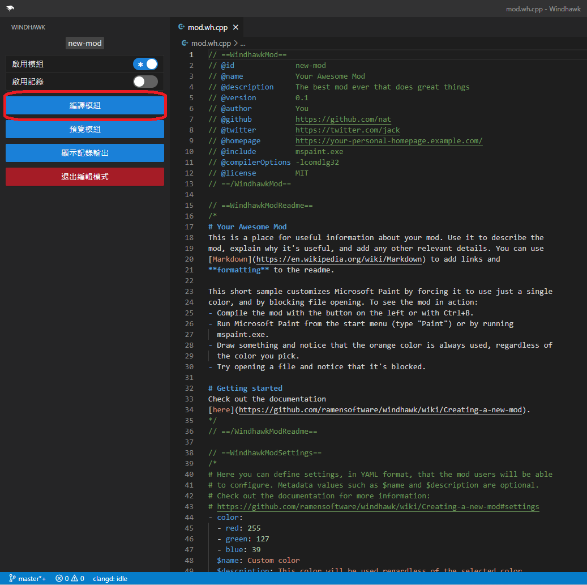
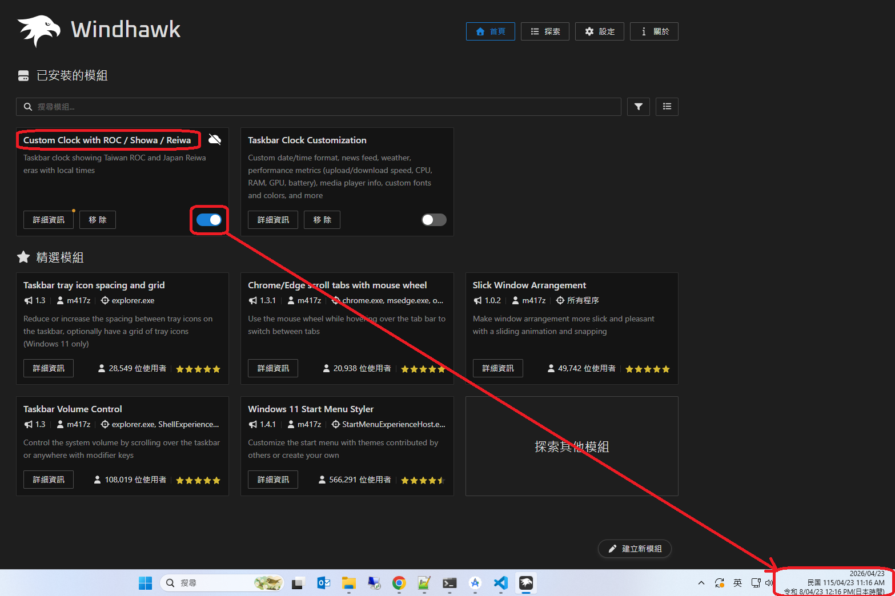

# windhawk 紀錄

### 官網
```https://windhawk.net/```
---

### 安裝後啟動畫面, 點擊建立新模組

---

### IDE編輯畫面

---

### 製作模組並編譯啟用

---

### 程式碼
````
// ==WindhawkMod==
// @id              custom-clock-era
// @name            Custom Clock with ROC / Showa / Reiwa
// @description     Taskbar clock showing Taiwan ROC and Japan Reiwa eras with local times
// @version         1.1.0
// @author          mickey
// @include         explorer.exe
// @architecture    x86-64
// ==/WindhawkMod==

// ==WindhawkModReadme==
/*
# Custom Clock with ROC / Showa / Reiwa

顯示台灣民國、日本昭和、令和年號，並附上各自時區的當地時間。

## 顯示範例
```
週二 14:47 (台北 UTC+8)
2026/04/21
民國 115/04/21 14:47
令和 8/04/21 15:47 (JST)
```

## 設定說明
- **showROC** - 顯示台灣民國年號與台北時間
- **showShowa** - 顯示日本昭和年號（1926~1989，現代不顯示）
- **showReiwa** - 顯示日本令和年號與日本時間 (JST)
- **rocTimezone** - 台灣時區偏移（小時），預設 8 = UTC+8
- **jstTimezone** - 日本時區偏移（小時），預設 9 = UTC+9
- **language** - 介面語言：zh / jp / en
- **trayHeight** - 工作列時鐘高度（像素），0 = 自動
*/
// ==/WindhawkModReadme==

// ==WindhawkModSettings==
/*
- showROC: true
  $name: 顯示民國年號
  $description: 在時鐘顯示台灣民國年號與台北時間

- showShowa: true
  $name: 顯示昭和年號
  $description: 在時鐘顯示日本昭和年號（適用1926~1988年）

- showReiwa: true
  $name: 顯示令和年號
  $description: 在時鐘顯示日本令和年號與日本時間

- rocTimezone: 8
  $name: 台灣時區 (UTC+?)
  $description: 台灣標準時間偏移小時數，預設 8 (UTC+8)

- jstTimezone: 9
  $name: 日本時區 (UTC+?)
  $description: 日本標準時間偏移小時數，預設 9 (UTC+9)

- language: zh
  $name: 語言
  $description: "年號標籤語言：zh 中文 / jp 日文 / en English"

- trayHeight: 60
  $name: 時鐘區域高度（像素）
  $description: "調整 tray 時鐘的高度以容納多行，建議 55~80，0 = 不調整"
*/
// ==/WindhawkModSettings==

#include <windows.h>
#include <string>

// ── 設定 ────────────────────────────────────────────────
struct Settings {
    bool showROC;
    bool showShowa;
    bool showReiwa;
    int  rocTimezone;   // UTC 偏移，小時
    int  jstTimezone;
    int  trayHeight;
    wchar_t language[8];
} g_settings;

void LoadSettings() {
    g_settings.showROC    = Wh_GetIntSetting(L"showROC")    != 0;
    g_settings.showShowa  = Wh_GetIntSetting(L"showShowa")  != 0;
    g_settings.showReiwa  = Wh_GetIntSetting(L"showReiwa")  != 0;
    g_settings.rocTimezone = Wh_GetIntSetting(L"rocTimezone");
    g_settings.jstTimezone = Wh_GetIntSetting(L"jstTimezone");
    g_settings.trayHeight  = Wh_GetIntSetting(L"trayHeight");

    // 預設值保護
    if (g_settings.rocTimezone == 0) g_settings.rocTimezone = 8;
    if (g_settings.jstTimezone == 0) g_settings.jstTimezone = 9;

    PCWSTR lang = Wh_GetStringSetting(L"language");
    wcsncpy_s(g_settings.language, lang ? lang : L"zh", _TRUNCATE);
    Wh_FreeStringSetting(lang);
}

// ── 語言標籤 ─────────────────────────────────────────────
static const wchar_t* GetLabel(const wchar_t* key) {
    bool isJp = (wcscmp(g_settings.language, L"jp") == 0);
    bool isEn = (wcscmp(g_settings.language, L"en") == 0);

    if (wcscmp(key, L"ROC")   == 0) return isEn ? L"ROC"   : (isJp ? L"民国" : L"民國");
    if (wcscmp(key, L"Showa") == 0) return isEn ? L"Showa" : L"昭和";
    if (wcscmp(key, L"Reiwa") == 0) return isEn ? L"Reiwa" : L"令和";
    if (wcscmp(key, L"JST")   == 0) return isEn ? L"JST"   : (isJp ? L"日本時間" : L"日本時間");
    return key;
}

// ── 時區轉換：UTC SYSTEMTIME → 指定偏移的本地時間 ──────────
// st 是呼叫端傳入的「本機時間」，先反推 UTC，再加上目標時區偏移
static SYSTEMTIME ConvertToTimezone(const SYSTEMTIME* localSt, int localUtcOffset, int targetUtcOffset) {
    // 把本機時間轉成 FILETIME（100ns 單位）
    FILETIME ft;
    SystemTimeToFileTime(localSt, &ft);

    ULARGE_INTEGER ui;
    ui.LowPart  = ft.dwLowDateTime;
    ui.HighPart = ft.dwHighDateTime;

    // 扣掉本機偏移，加上目標偏移（單位：100ns * 秒 * 分 * 時）
    constexpr ULONGLONG kHour = 10000000ULL * 3600;
    int diffHours = targetUtcOffset - localUtcOffset;
    if (diffHours >= 0) {
        ui.QuadPart += (ULONGLONG)diffHours * kHour;
    } else {
        ui.QuadPart -= (ULONGLONG)(-diffHours) * kHour;
    }

    ft.dwLowDateTime  = ui.LowPart;
    ft.dwHighDateTime = ui.HighPart;

    SYSTEMTIME result;
    FileTimeToSystemTime(&ft, &result);
    return result;
}

// ── 取得系統本機時區偏移（分鐘 → 小時）────────────────────
static int GetLocalUtcOffsetHours() {
    TIME_ZONE_INFORMATION tzi;
    DWORD r = GetTimeZoneInformation(&tzi);
    // Bias 是「UTC = 本地 + Bias（分鐘）」，所以偏移 = -Bias/60
    long bias = tzi.Bias;
    if (r == TIME_ZONE_ID_DAYLIGHT) bias += tzi.DaylightBias;
    else                             bias += tzi.StandardBias;
    return (int)(-bias / 60);
}

// ── 時鐘文字 ─────────────────────────────────────────────
static std::wstring BuildClockText(const SYSTEMTIME* st) {
    int year  = st->wYear;
    int month = st->wMonth;
    int day   = st->wDay;
    int hour  = st->wHour;
    int min   = st->wMinute;

    // 取得本機時區，用來做時區換算
    int localOffset = GetLocalUtcOffsetHours();

    // 年號計算
    int roc = year - 1911;

    int showa = 0;
    if (year > 1926 || (year == 1926 && month == 12 && day >= 25))
        if (year < 1989 || (year == 1989 && month == 1 && day <= 7))
            showa = year - 1925;

    int reiwa = 0;
    if (year > 2019 || (year == 2019 && (month > 5 || (month == 5 && day >= 1))))
        reiwa = year - 2018;

    wchar_t buf[256];

    // ── 12小時制轉換 helper ──────────────────────────────
    // 傳入 24h 的 hour，輸出 12h（1~12）與 AM/PM 字串
    auto To12h = [](int h24, int& h12, const wchar_t*& ampm) {
        ampm = (h24 < 12) ? L"AM" : L"PM";
        h12  = h24 % 12;
        if (h12 == 0) h12 = 12;  // 0:xx→12:xx AM，12:xx→12:xx PM
    };

    // 第一行：本機時間（12小時制）
    {
        int h12; const wchar_t* ampm;
        To12h(hour, h12, ampm);
        swprintf_s(buf, L"%d:%02d %ls", h12, min, ampm);
    }
    std::wstring result = buf;

    // 第二行：西元日期
    swprintf_s(buf, L"\n%04d/%02d/%02d", year, month, day);
    result += buf;

    // ── 民國行：台灣時間（12小時制）─────────────────────
    if (g_settings.showROC && roc > 0) {
        SYSTEMTIME roc_st = ConvertToTimezone(st, localOffset, g_settings.rocTimezone);
        int roc_year  = roc_st.wYear - 1911;
        int h12; const wchar_t* ampm;
        To12h(roc_st.wHour, h12, ampm);

        swprintf_s(buf, L"\n%ls %d/%02d/%02d %d:%02d %ls",
                   GetLabel(L"ROC"), roc_year, roc_st.wMonth, roc_st.wDay,
                   h12, roc_st.wMinute, ampm);
        result += buf;
    }

    // ── 昭和行（無時間，現代基本不顯示）─────────────────
    if (g_settings.showShowa && showa > 0) {
        if (showa == 1) {
            swprintf_s(buf, L"\n%ls 元/%02d/%02d",
                       GetLabel(L"Showa"), month, day);
        } else {
            swprintf_s(buf, L"\n%ls %d/%02d/%02d",
                       GetLabel(L"Showa"), showa, month, day);
        }
        result += buf;
    }

    // ── 令和行：日本時間 JST（12小時制）─────────────────
    if (g_settings.showReiwa && reiwa > 0) {
        SYSTEMTIME jst = ConvertToTimezone(st, localOffset, g_settings.jstTimezone);
        int jst_reiwa = jst.wYear - 2018;
        int h12; const wchar_t* ampm;
        To12h(jst.wHour, h12, ampm);

        if (jst_reiwa == 1) {
            swprintf_s(buf, L"\n%ls 元/%02d/%02d %d:%02d %ls(%ls)",
                       GetLabel(L"Reiwa"), jst.wMonth, jst.wDay,
                       h12, jst.wMinute, ampm, GetLabel(L"JST"));
        } else {
            swprintf_s(buf, L"\n%ls %d/%02d/%02d %d:%02d %ls(%ls)",
                       GetLabel(L"Reiwa"), jst_reiwa, jst.wMonth, jst.wDay,
                       h12, jst.wMinute, ampm, GetLabel(L"JST"));
        }
        result += buf;
    }

    return result;
}

// ── Hook ─────────────────────────────────────────────────
using GetTimeFormatEx_t = decltype(&GetTimeFormatEx);
GetTimeFormatEx_t OriginalGetTimeFormatEx = nullptr;

using GetDateFormatEx_t = decltype(&GetDateFormatEx);
GetDateFormatEx_t OriginalGetDateFormatEx = nullptr;

// 攔截時間格式函數，把整段時鐘文字塞進去
int WINAPI HookedGetTimeFormatEx(
    LPCWSTR     lpLocaleName,
    DWORD       dwFlags,
    const SYSTEMTIME* lpTime,
    LPCWSTR     lpFormat,
    LPWSTR      lpTimeStr,
    int         cchTime)
{
    if (!lpTime || !lpTimeStr || cchTime == 0) {
        return OriginalGetTimeFormatEx(
            lpLocaleName, dwFlags, lpTime, lpFormat, lpTimeStr, cchTime);
    }

    std::wstring text = BuildClockText(lpTime);

    // cchTime == 0 表示查詢所需長度
    if (cchTime == 0) {
        return (int)text.size() + 1;
    }

    if ((int)text.size() + 1 > cchTime) {
        // 緩衝區不夠，回傳需要的大小（讓呼叫端重試）
        SetLastError(ERROR_INSUFFICIENT_BUFFER);
        return 0;
    }

    wcscpy_s(lpTimeStr, cchTime, text.c_str());
    return (int)text.size() + 1;
}

// 攔截日期格式函數，回傳空字串（日期已整合在時間行裡）
int WINAPI HookedGetDateFormatEx(
    LPCWSTR     lpLocaleName,
    DWORD       dwFlags,
    const SYSTEMTIME* lpDate,
    LPCWSTR     lpFormat,
    LPWSTR      lpDateStr,
    int         cchDate,
    LPCWSTR     lpCalendar)
{
    if (!lpDateStr || cchDate == 0) {
        return OriginalGetDateFormatEx(
            lpLocaleName, dwFlags, lpDate, lpFormat,
            lpDateStr, cchDate, lpCalendar);
    }

    // 回傳空字串，避免重複顯示日期
    lpDateStr[0] = L'\0';
    return 1;
}

// ── Windhawk 生命週期 ──────────────────────────────────────
BOOL Wh_ModInit() {
    LoadSettings();

    // 必須 hook kernelbase.dll 的版本，不能直接用函數指標
    HMODULE hKernelBase = GetModuleHandleW(L"kernelbase.dll");
    if (!hKernelBase) {
        Wh_Log(L"找不到 kernelbase.dll");
        return FALSE;
    }

    auto pGetTimeFormatEx = (GetTimeFormatEx_t)
        GetProcAddress(hKernelBase, "GetTimeFormatEx");
    auto pGetDateFormatEx = (GetDateFormatEx_t)
        GetProcAddress(hKernelBase, "GetDateFormatEx");

    if (!pGetTimeFormatEx || !pGetDateFormatEx) {
        Wh_Log(L"找不到目標函數");
        return FALSE;
    }

    Wh_SetFunctionHook(
        (void*)pGetTimeFormatEx,
        (void*)HookedGetTimeFormatEx,
        (void**)&OriginalGetTimeFormatEx);

    Wh_SetFunctionHook(
        (void*)pGetDateFormatEx,
        (void*)HookedGetDateFormatEx,
        (void**)&OriginalGetDateFormatEx);

    return TRUE;
}

// 找到時鐘視窗並強制重新整理，同時調整 tray 高度
void ApplySettings() {
    // ── Tray 時鐘高度調整 ──────────────────────────────────
    // 找 TrayClockWClass（Win10）或直接改 TrayNotifyWnd 子視窗大小
    if (g_settings.trayHeight > 0) {
        HWND hTaskbar   = FindWindowW(L"Shell_TrayWnd", nullptr);
        HWND hTrayNotify = hTaskbar
            ? FindWindowExW(hTaskbar, nullptr, L"TrayNotifyWnd", nullptr)
            : nullptr;
        HWND hClock = hTrayNotify
            ? FindWindowExW(hTrayNotify, nullptr, L"TrayClockWClass", nullptr)
            : nullptr;

        if (hClock) {
            // 取得目前位置，只改高度
            RECT rc;
            GetWindowRect(hClock, &rc);
            POINT pt = { rc.left, rc.top };
            ScreenToClient(hTrayNotify, &pt);
            int w = rc.right - rc.left;
            SetWindowPos(hClock, nullptr,
                         pt.x, pt.y, w, g_settings.trayHeight,
                         SWP_NOZORDER | SWP_NOACTIVATE);
        }
    }

    // ── Win10：送 WM_SIZE 觸發重算 ───────────────────────
    HWND hTaskbar = FindWindowW(L"Shell_TrayWnd", nullptr);
    if (hTaskbar) {
        RECT rc;
        if (GetClientRect(hTaskbar, &rc)) {
            SendMessageW(hTaskbar, WM_SIZE, SIZE_RESTORED,
                         MAKELPARAM(rc.right - rc.left, rc.bottom - rc.top));
        }
    }

    // ── Win11：寫入再刪除暫存登錄值，觸發時鐘 watcher 更新 ──
    HKEY hKey;
    if (RegOpenKeyExW(HKEY_CURRENT_USER,
                      L"Control Panel\\TimeDate\\AdditionalClocks",
                      0, KEY_WRITE, &hKey) == ERROR_SUCCESS) {
        const wchar_t* kTemp = L"_tmp_custom_clock_era";
        RegSetValueExW(hKey, kTemp, 0, REG_SZ,
                       (const BYTE*)L"", sizeof(wchar_t));
        RegDeleteValueW(hKey, kTemp);
        RegCloseKey(hKey);
    }
}

// Hook 安裝完成後立即觸發一次，不用重啟 explorer
void Wh_ModAfterInit() {
    ApplySettings();
}

void Wh_ModUninit() {
    ApplySettings();  // 移除時重整，還原原始時鐘
}

BOOL Wh_ModSettingsChanged(BOOL* bReload) {
    LoadSettings();
    *bReload = FALSE;
    ApplySettings();  // 設定變更後立即生效
    return TRUE;
}
````
---

### 執行結果畫面
